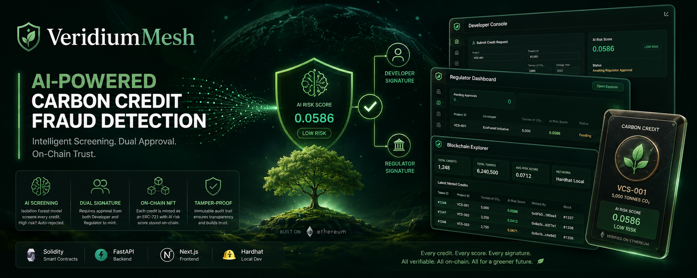

<div align="center">



### AI-Powered Carbon Credit Fraud Detection on Ethereum

[](https://python.org)
[](https://fastapi.tiangolo.com)
[](https://soliditylang.org)
[](https://nextjs.org)
[](https://hardhat.org)
[](https://scikit-learn.org)
[](LICENSE)

*CSE540 Blockchain — Team 16 · Arizona State University · Spring 2026*

</div>

---

## The Problem

The global carbon credit market is worth **$2 billion+** — and riddled with fraud. Projects inflate issuance volumes by 10×, credits are double-counted across registries, and some projects don't even exist. Existing registries rely on manual audits that are slow, expensive, and gameable.

**VeridiumMesh is the answer:** a decentralized, AI-gated system that makes it cryptographically impossible to mint a fraudulent carbon credit.

---

## What Makes This Project Unique

> These are the standout engineering decisions a recruiter or reviewer should notice.

| # | Unique Trait | Detail |
|---|---|---|
| 🤖 | **AI-Gated Smart Contract** | An Isolation Forest ML model trained on 5,700 real projects screens every credit *before* it touches the blockchain. Credits with a risk score ≥ 0.7 are auto-rejected — the contract never even sees them. |
| ✍️ | **Dual ECDSA Multi-Signature Minting** | `issueCredit()` uses Solidity's `ecrecover` to verify two independent ECDSA signatures on-chain — one from a registered developer, one from a registered regulator. Neither party can mint alone. |
| ⛏️ | **Proof-of-Work Per Credit** | Every mint requires the backend to find a nonce where `keccak256(creditId + nonce)` has its top 8 bits as zero. This makes spam-minting computationally expensive, mirroring Bitcoin-style PoW. |
| 🌿 | **On-Chain Merkle Tree** | Every issued credit becomes a leaf in a live Merkle tree stored in the contract. Anyone can request an O(log n) inclusion proof and verify it trustlessly — no external oracle needed. |
| 🔗 | **Immutable AI Audit Trail** | The AI risk score is encoded as a uint256 (multiplied by 10,000) and permanently written into the NFT. Regulators can cryptographically verify that screening happened — forever. |
| 🏛️ | **Role-Based Decentralized Governance** | Admin, Registrar, Developer, and Regulator roles are managed entirely on-chain. No single address controls the system. |
| 🪙 | **ERC-721 Carbon Credit NFTs** | Each credit is a unique non-fungible token. Transfers and retirements (burns) are logged as Ethereum events — a tamper-proof, real-time audit trail. |
| 🔬 | **Real-World Training Data** | The Isolation Forest was trained on the **Berkeley Voluntary Registry Offsets Database (VROD)** — ~5,700 actual carbon credit projects, not synthetic data. |

---

## Skills & Technologies Demonstrated

```
Machine Learning          │  Isolation Forest · scikit-learn · joblib · Feature Engineering
Blockchain / Solidity     │  ERC-721 · ecrecover · Merkle Tree · Proof-of-Work · OpenZeppelin
Backend                   │  FastAPI · Web3.py · Pydantic · Uvicorn · REST API Design
Frontend                  │  Next.js 16 · TypeScript · Tailwind CSS · shadcn/ui · ethers.js
Cryptography              │  ECDSA Signatures · EIP-191 Message Hashing · keccak256 · Merkle Proofs
Testing                   │  pytest · Hardhat (30+ Solidity unit tests) · httpx · Jest
DevOps / Tooling          │  Hardhat local node · MetaMask integration · Jupyter notebooks
Data Science              │  Berkeley VROD dataset · EDA · Pandas · NumPy
```

---

## Architecture

```
┌─────────────────────────────────────────────────────────────────────────────┐
│                           USER (Browser + MetaMask)                          │
└────────────────────┬───────────────────────────────────────┬────────────────┘
                     │ HTTP (fetch)                           │ ethers.js direct calls
                     ▼                                        ▼
┌────────────────────────────────┐          ┌─────────────────────────────────┐
│         Next.js Frontend       │          │     Ethereum (Hardhat / Mainnet) │
│         localhost:3000          │          │         Chain ID: 31337          │
│                                │          │                                  │
│  ┌──────────────────────────┐  │          │  ┌───────────────────────────┐  │
│  │   Developer Console      │  │          │  │   CarbonCredit.sol (ERC721)│  │
│  │  Submit credit + sign    │  │          │  │                           │  │
│  └──────────────────────────┘  │          │  │  issueCredit()            │  │
│  ┌──────────────────────────┐  │          │  │  ├─ verify PoW nonce      │  │
│  │   Regulator Dashboard    │  │          │  │  ├─ ecrecover (dev sig)   │  │
│  │  Review AI score + sign  │  │          │  │  ├─ ecrecover (reg sig)   │  │
│  └──────────────────────────┘  │          │  │  ├─ mint ERC-721 NFT      │  │
│  ┌──────────────────────────┐  │          │  │  └─ update Merkle tree    │  │
│  │   Blockchain Explorer    │  │          │  │                           │  │
│  │  Lookup + Merkle proofs  │  │          │  │  transferCredit()         │  │
│  └──────────────────────────┘  │          │  │  retireCredit() [burn]    │  │
└────────────────────┬───────────┘          │  │  verifyCredit() [proof]   │  │
                     │ REST API             │  └───────────────────────────┘  │
                     ▼                      └──────────────▲──────────────────┘
┌────────────────────────────────┐                         │ web3.py / contract call
│       FastAPI Backend          │─────────────────────────┘
│       localhost:8000           │
│                                │
│  POST /credits/pending         │  ◄── Developer submits
│  GET  /credits/pending         │  ◄── Regulator fetches queue
│  POST /credits/approve/{id}    │  ─── Regulator approves → triggers mint
│  GET  /credits/{id}/proof      │  ◄── Merkle inclusion proof
│  GET  /chain/stats             │  ◄── Live block / Merkle root
│                                │
│  ┌──────────────────────────┐  │
│  │   ML Scoring Layer       │  │
│  │   ml/model.py            │  │
│  │                          │  │
│  │  Input features:         │  │
│  │  • R_ratio (vol/avg)     │  │
│  │  • Vintage_Age           │  │
│  │  • M_flag (project type) │  │
│  │  • T_flag (volume spike) │  │
│  │                          │  │
│  │  Isolation Forest ──────►│  │
│  │  score ≥ 0.7 → REJECT    │  │
│  │  score < 0.7 → PENDING   │  │
│  └──────────────────────────┘  │
└────────────────────────────────┘
```

### End-to-End Credit Lifecycle

```
Developer fills form
        │
        ▼
[Frontend] Sign with MetaMask ──► POST /credits/pending
        │
        ▼
[Backend] Run Isolation Forest
        │
   ┌────┴────┐
score ≥ 0.7  score < 0.7
   │            │
REJECTED     QUEUED
             │
             ▼
   Regulator opens Dashboard
             │
             ▼
   [Frontend] Sign with MetaMask ──► POST /credits/approve/{id}
             │
             ▼
   [Backend] Mine PoW nonce
             │
             ▼
   [Backend] Sign dev + reg endorsements (ECDSA / EIP-191)
             │
             ▼
   [Contract] issueCredit()
     ├─ verify keccak256(creditId+nonce) top-8-bits == 0
     ├─ ecrecover(devSig) → must be registered developer
     ├─ ecrecover(regSig) → must be registered regulator
     ├─ mint ERC-721 NFT
     ├─ store AI risk score on-chain (uint256 × 10,000)
     ├─ emit CreditIssued event
     └─ update on-chain Merkle tree → emit MerkleRootUpdated
             │
             ▼
   Credit lives as an NFT forever
   Owner can transfer or retire (burn) it at any time
```

---

---

## Quick Start

```bash
# Terminal 1 — Local Ethereum node
cd ethereum && ./node_modules/.bin/hardhat node

# Terminal 2 — Deploy contract (after node is up)
cd ethereum && ./node_modules/.bin/hardhat run scripts/deploy.js --network localhost

# Terminal 3 — FastAPI backend
source veridium/bin/activate
PYTHONPATH=. python -m uvicorn api.app:app --reload --port 8000

# Terminal 4 — Next.js frontend
cd frontend && npm install && npm run dev
```

**MetaMask Setup:**
- Network: `Hardhat Local` · RPC: `http://127.0.0.1:8545` · Chain ID: `31337`
- Developer account: import private key `0x59c6995e998f97a5a0044966f0945389dc9e86dae88c7a8412f4603b6b78690d`
- Regulator account: import private key `0x92db14e403b83dfe3df233f83dfa3a0d7096f21ca9b0d6d6b8d88b2b4ec1564e`

| Service | URL |
|---|---|
| Frontend | http://localhost:3000 |
| API (+ Swagger docs) | http://127.0.0.1:8000/docs |
| Hardhat RPC | http://127.0.0.1:8545 |

---

## Repository Structure

```
VeridiumMesh/
├── api/
│   └── app.py                    # FastAPI backend (ML scoring, PoW mining, on chain minting)
├── ethereum/
│   ├── contracts/
│   │   └── CarbonCredit.sol      # Solidity smart contract (ERC721, PoW, Merkle tree, ecrecover)
│   ├── scripts/
│   │   └── deploy.js             # Hardhat deploy script (registers developer + regulator roles)
│   ├── test/
│   │   └── CarbonCredit.test.js  # 30+ unit tests for the contract
│   └── hardhat.config.js
├── ml/
│   ├── model.py                  # scoreProject() — Isolation Forest inference
│   ├── train_isoforest.py        # Training script
│   ├── isoforest.joblib          # Trained model artifact
│   ├── scaler.joblib
│   └── norm_params.joblib
├── frontend/                     # Next.js 16 + Tailwind + shadcn/ui
│   └── src/app/
│       ├── page.tsx              # Landing page with live chain stats
│       ├── developer/page.tsx    # Developer console (submit credits via MetaMask)
│       ├── regulator/page.tsx    # Regulator dashboard (review and approve pending credits)
│       └── explorer/page.tsx     # Blockchain explorer (credit lookup, Merkle proof verification)
├── tests/                        # Python unit tests (pytest)
├── data/                         # Berkeley VROD CSVs + EDA and feature plots
├── notebooks/                    # Jupyter EDA and feature engineering notebooks
├── scripts/                      # Utility scripts (feature engineering, EDA)
└── requirements.txt
```

---

## How the System Works End to End

1. A developer connects their MetaMask wallet on the Developer Console page and fills in the project details (project ID, type, tonnes, vintage year).

2. They click "Sign & Submit for Approval". MetaMask asks them to sign the request. The frontend sends it to `POST /credits/pending`.

3. The backend runs the AI model on the project features. If the risk score is too high (>= 0.7), the credit is rejected immediately. Otherwise it goes into a pending queue.

4. The regulator opens the Regulator Dashboard, sees the pending credit with its AI risk score, and clicks "Approve & Sign". MetaMask asks them to sign.

5. The backend then does the actual on chain minting: mines a proof of work nonce, generates both ECDSA endorsement signatures, and calls the smart contract's `issueCredit()` function with all 9 parameters.

6. The contract verifies the PoW, validates all inputs, recovers both signatures to confirm they came from a registered developer and regulator, stores the credit, mints an ERC721 NFT, and updates the on chain Merkle tree.

7. The credit now exists as an NFT. The owner can transfer it to someone else or retire (burn) it permanently. Both actions require MetaMask signing.

8. Anyone can look up any credit on the Explorer page, see its full details and AI risk score, and get a Merkle inclusion proof that can be verified directly against the contract.

---

## Smart Contract — CarbonCredit.sol

Written in Solidity ^0.8.28, deployed on a local Hardhat node. Every carbon credit is an ERC721 NFT.

### Functions

| Function | Who Calls It | What It Does |
|---|---|---|
| `issueCredit(creditId, tonnes, developerId, regulatorId, aiRiskScore, owner, nonce, devSig, regSig)` | Backend (after regulator approval) | Verifies PoW, recovers both ECDSA signatures, validates inputs, mints the NFT, updates the Merkle tree |
| `transferCredit(creditId, to)` | Credit owner via MetaMask | Transfers the NFT to a new address. Reverts if the credit is retired. |
| `retireCredit(creditId)` | Credit owner via MetaMask | Burns the NFT permanently. Irreversible. |
| `getCredit(creditId)` | Anyone | Returns tonnes, developerId, regulatorId, aiRiskScore, owner, isRetired, tokenId |
| `endorsementHash(creditId, tonnes, owner)` | Read only | Returns the EIP191 hash that signers need to sign off chain |
| `getCreditLeafHash(creditId)` | Read only | Returns the Merkle leaf hash for a credit |
| `verifyCredit(proof, leaf)` | Read only | Verifies a Merkle inclusion proof against the current root |
| `addDeveloper(addr)` / `addRegulator(addr)` / `addRegistrar(addr)` | Admin only | Manages role assignments for decentralized access control |

### Events (Audit Trail)

| Event | When It Fires |
|---|---|
| `CreditIssued(creditId, owner, tonnes, aiRiskScore, developerId, regulatorId, tokenId)` | Credit is minted |
| `CreditTransferred(creditId, from, to)` | Credit changes owner |
| `CreditRetired(creditId, owner)` | Credit is permanently burned |
| `MerkleRootUpdated(newRoot, totalCredits)` | Merkle tree is updated after a mint |

### Risk Score Encoding

The AI risk score is a float between 0 and 1, but Solidity doesn't do floats. So we multiply by 10,000 and store it as a uint256. For example 0.8451 becomes 8451 on chain. Divide by 10,000 to get the original float back.

---

## REST API Endpoints

| Method | Endpoint | Description |
|---|---|---|
| `POST` | `/credits/issue` | Scores the project with AI, mines PoW, signs both endorsements, mints on chain |
| `POST` | `/credits/pending` | Developer submits a credit for regulator review (AI scored but not minted yet) |
| `GET` | `/credits/pending` | Lists all credits waiting for regulator approval |
| `POST` | `/credits/approve/{pending_id}` | Regulator approves a pending credit, triggers on chain mint |
| `GET` | `/credits/{credit_id}` | Reads credit state from the contract |
| `GET` | `/credits/{credit_id}/proof` | Returns a Merkle inclusion proof for the credit |
| `GET` | `/chain/stats` | Live stats: chain ID, latest block, contract address, Merkle root, total credits |
| `GET` | `/chain/events` | All CreditIssued, CreditTransferred, and CreditRetired events |
| `GET` | `/stakeholders` | List of registered stakeholder names and addresses |

Transfer and retire are called directly from the browser through MetaMask and ethers.js, no server roundtrip needed.

---

## AI Scoring Layer — scoreProject() in ml/model.py

The model takes four features that get computed automatically from the project type and tonnes:

- **R_ratio**: tonnes divided by 50,000 (the peer average). Measures how inflated the claim is.
- **Vintage_Age**: 2026 minus the vintage year. Older projects are more suspicious.
- **M_flag**: 1 if the project type is historically high risk (Solar, REDD+, Wind, Hydro, etc.), 0 otherwise.
- **T_flag**: 1 if R_ratio is above 3.0 (extreme volume spike), 0 otherwise.

Returns a score between 0.0 and 1.0. Higher means more suspicious. Anything at or above 0.7 is flagged as HIGH RISK and the contract will reject it.

Example scores:
- Cookstoves project, 5,000 tonnes, recent vintage: **0.25** (low risk)
- Solar project, 600,000 tonnes, 18 year old vintage: **0.85** (high risk, rejected)

---

## Testing

### Python (pytest)
```bash
PYTHONPATH=. python -m pytest tests/ -v
```
Covers: ML scoring, API endpoints (httpx), blockchain interaction mocks.

### Solidity (Hardhat / Mocha)
```bash
cd ethereum && ./node_modules/.bin/hardhat test
```
30+ unit tests covering: PoW validation, dual-sig minting, role access control, transfer, retirement, Merkle proof verification, and edge case reverts.

### Frontend (Jest)
```bash
cd frontend && npm test
```
Covers: wallet context, contract helpers, API client, and page components.

---

## Blockchain Principles Demonstrated

| Principle | Where in the Code |
|---|---|
| ERC721 NFT Standard | Every credit is a unique non fungible token. Transfers and burns use the ERC721 ledger. MetaMask shows them as NFTs. |
| ecrecover Multi Sig Endorsement | Minting requires valid ECDSA signatures from both a registered developer and a registered regulator. The contract recovers signer addresses on chain and checks them against the role registry. |
| Proof of Work | Every mint requires a nonce where keccak256(creditId + nonce) has the top 8 bits as zero. About 256 attempts on average. |
| Merkle Tree | Each credit is a leaf in an on chain Merkle tree. Inclusion proofs can be verified in O(log n) using OpenZeppelin MerkleProof. |
| Decentralization | The admin can register multiple independent registrars, developers, and regulators. No single address controls all roles. |
| Immutable Ledger | Every transaction is permanently recorded on Ethereum. |
| Audit Trail | Event logs for every issuance, transfer, and retirement. |

---
</div>
